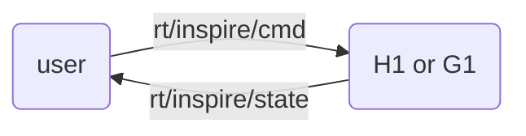

<div align="center">
  <h1 align="center">DFX Inspire Hand service</h1>
  <a href="https://www.unitree.com/" target="_blank">
    
  </a>
</div>

# 1. 📦 Introduction

[Unitree Robot RH56DFX Inspire Hand](https://support.unitree.com/home/en/H1_developer/Dexterous_hand) Controller.

<div align="center">
  
</div>


The user sends `unitree_go::msg::dds::MotorCmds_` messages to the `rt/inspire/cmd` topic to control the dexterous hand,
and receives `unitree_go::msg::dds::MotorStates_` messages from the `rt/inspire/state` topic to obtain its status.



The IDL data is an array containing joint-level values for all 12 motors of both hands.
The force-safe G1 service keeps `q` position control compatible with the
original protocol and uses previously reserved fields when `mode=1`:

| Field | Meaning |
|---|---|
| `MotorCmd.q` | Position (`1=open`, `0=closed`) |
| `MotorCmd.dq` | RH56 raw speed (`1..1000`) |
| `MotorCmd.tau` | Per-actuator force threshold (`1..1000`, nominal grams) |
| `MotorState.q` | Measured position |
| `MotorState.tau_est` | Measured force in newtons |
| `MotorState.mode` | `1` while the local contact latch is active |

Commands without `mode=1` use conservative defaults: closing speed `25`,
opening speed `1000`, and force threshold `100`.


<div style="text-align: center;">
<table border="1">
  <tr>
    <td>Id</td>
    <td>0</td>
    <td>1</td>
    <td>2</td>
    <td>3</td>
    <td>4</td>
    <td>5</td>
    <td>6</td>
    <td>7</td>
    <td>8</td>
    <td>9</td>
    <td>10</td>
    <td>11</td>
  </tr>
  <tr>
    <td rowspan="2">Joint</td>
    <td colspan="6">Right Hand</td>
    <td colspan="6">Left Hand</td>
  </tr>
  <tr>
    <td>pinky</td>
    <td>ring</td>
    <td>middle</td>
    <td>index</td>
    <td>thumb-bend</td>
    <td>thumb-rotation</td>
    <td>pinky</td>
    <td>ring</td>
    <td>middle</td>
    <td>index</td>
    <td>thumb-bend</td>
    <td>thumb-rotation</td>
  </tr>
</table>
</div>


# 2. 🚀 Launch

## unitree h1
```bash
sudo apt install libboost-all-dev libspdlog-dev
# Build project
mkdir build & cd build
cmake ..
make -j6
# Terminal 1. Run h1 inspire hand service
sudo ./inspire_h1 -s /dev/ttyUSB0
# Terminal 2. Run example
./hand_example
```

## unitree g1
```bash
sudo apt install libboost-all-dev libspdlog-dev
# Build project
mkdir build & cd build
cmake ..
make -j6
# Terminal 1. Run g1 inspire hand service
# The serial port name is hard-coded; if it doesn’t match your setup, please edit it directly in the source.
sudo ./inspire_g1
# Terminal 2. Run example
./hand_example
```

### G1 force-safety behavior

Force protection runs next to the serial driver on the G1, independently of
the remote DDS round trip. The service configures the hand firmware with
`SetVelocity` and `SetForce`, reads each actuator through `GetForce`, and
latches that actuator at contact. A force overshoot commands a small opening
backoff. If position or force feedback fails, further closure is blocked while
opening remains available. Startup is observation-only until the first valid
DDS command arrives; if the command stream times out later, the service holds
the measured position instead of continuing toward an old closing target.

Before using this on a robot:

1. Keep the hand suspended and have an emergency-stop operator ready.
2. Stop every other process using `/dev/ttyUSB1` and `/dev/ttyUSB2`.
3. Confirm the one-second `[InspireForce]` values are plausible with no load.
4. Confirm opening direction before attempting closure.
5. Test one finger on a soft object at the default threshold.
6. Measure force externally and calibrate every physical finger separately.

To zero both force sensors without accepting any motion command, unload every
finger and run:

```bash
sudo ./build/inspire_g1 --network eth0 --namespace inspire \
  --calibrate-force --open-before-calibration \
  --return-to-protective-pose --monitor-only
```

The explicit open option moves both hands slowly and verifies their position
before calibration. Clear the workspace first. Calibration then runs
sequentially and takes about 20 seconds in total. Do not touch, support, or
load either hand until `Unloaded baseline captured` appears.
Afterward, the process remains in monitor-only mode and prints force feedback;
restart it without the calibration flags for normal control.

Calibration captures a per-actuator unloaded median baseline and saves it to
`/var/lib/dfx_inspire_service/force_baseline.txt`. Reported force and software
contact limits use force above that baseline; the firmware force threshold is
shifted by the same offset. Normal control refuses to start without a valid
saved baseline. Use `--force-baseline-file PATH` to select another location.
After calibration the service waits three seconds for sensor settling, then
accepts only a recent 31-sample window whose per-actuator spread is at most
50 g; an early transient therefore ages out instead of invalidating the run.

Some hand firmware versions do not return a recognizable calibration
acknowledgement. The service warns and continues in that case, then relies on
the verified open posture and stable unloaded baseline to accept calibration.

`--return-to-protective-pose` then closes at raw speed 25 toward
`[0, 0, 0, 0, 0.270, 0.978]` for each hand. Firmware and software force checks
limit each actuator to 100 g above its measured baseline during this move.

Diagnostics use `raw/base/net` grams per actuator. `[C]` means that actuator's
contact latch is active. Slow baseline drift compensation is enabled only
while the corresponding actuator is physically open and far below contact.
Signed negative baseline values are valid sensor offsets. They are subtracted
in software but never reduce the firmware's requested force threshold.

Do not reuse force calibration coefficients from a different hand. Software
cannot provide the shutdown pose during power loss, `SIGKILL`, or a hardware
fault.

# FAQ
1. Error when `make -j6`
    ```bash
    ...
    /usr/bin/ld: inspire_ctrl.cpp:(.text._Z14serialize_intoIN10unitree_go3msg4dds_12MotorStates_EN3org7eclipse10cyclonedds4core3cdr14xcdr_v2_streamEEbPvmRKT_b[_Z14serialize_intoIN10unitree_go3msg4dds_12MotorStates_EN3org7eclipse10cyclonedds4core3cdr14xcdr_v2_streamEEbPvmRKT_b]+0x2be): undefined reference to `org::eclipse::cyclonedds::core::cdr::xcdr_v2_stream::finish_member(org::eclipse::cyclonedds::core::cdr::entity_properties&, bool)'
    /usr/bin/ld: inspire_ctrl.cpp:(.text._Z14serialize_intoIN10unitree_go3msg4dds_12MotorStates_EN3org7eclipse10cyclonedds4core3cdr14xcdr_v2_streamEEbPvmRKT_b[_Z14serialize_intoIN10unitree_go3msg4dds_12MotorStates_EN3org7eclipse10cyclonedds4core3cdr14xcdr_v2_streamEEbPvmRKT_b]+0x2d9): undefined reference to `org::eclipse::cyclonedds::core::cdr::xcdr_v2_stream::finish_struct(org::eclipse::cyclonedds::core::cdr::entity_properties&)'
    
    ```
    please compile and install `unitree_sdk2`:
    ```bash
    cd ~
    git clone https://github.com/unitreerobotics/unitree_sdk2
    cd unitree_sdk2
    mkdir build & cd build
    cmake ..
    sudo make install
    ```
2. Error when run `sudo ./inspire_h1 -s /dev/ttyUSB0` or `sudo ./inspire_g1`
    ```bash
    --- Unitree Robotics --- 
    Inspire Hand Controller  
    Open serial port /dev/ttyUSB* failed
    ```
    For **Unitree h1**, use the `-s` parameter to change the serial port name.  
    For **Unitree g1**, modify the serial port name directly in the source code.
